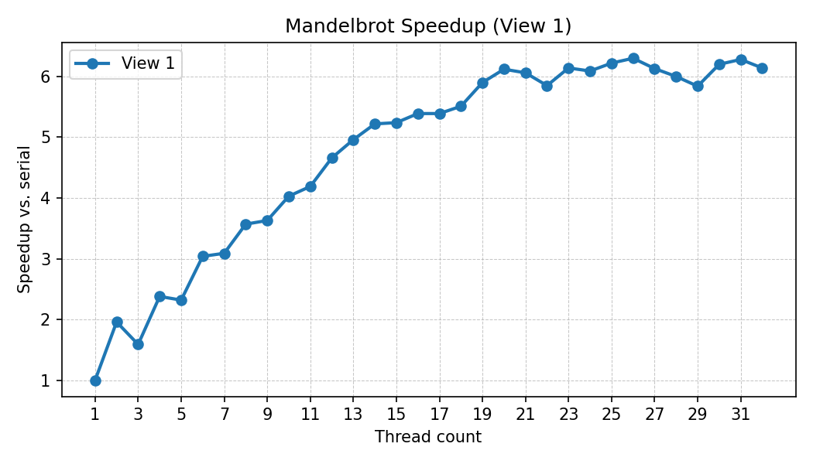
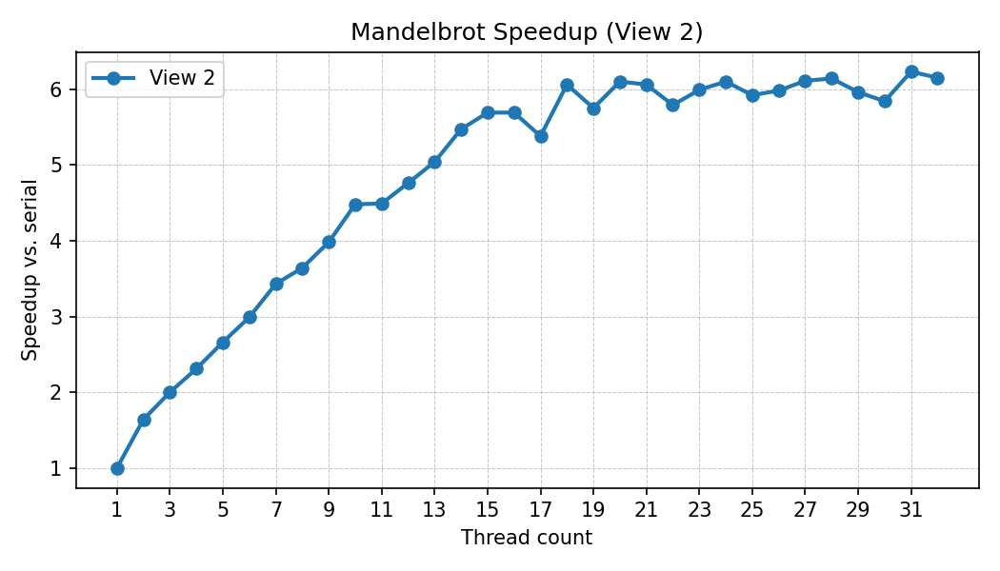

# Env

System: macOS 26.01

Chip: Apple M4

Cores: 10 (4 performance and 6 efficiency)

# Prog1

| threadNum | 1    | 2     | 4     | 8     | 16    |
| --------- | ---- | ----- | ----- | ----- | ----- |
| Speedup   | 1x   | 1.64x | 2.31x | 3.40x | 5.57x |

Unable to optimize on macOS...
Transfer to Arch Linux

After optimization(Speedup):
view1: 10.28x
view2: 9.3x 
